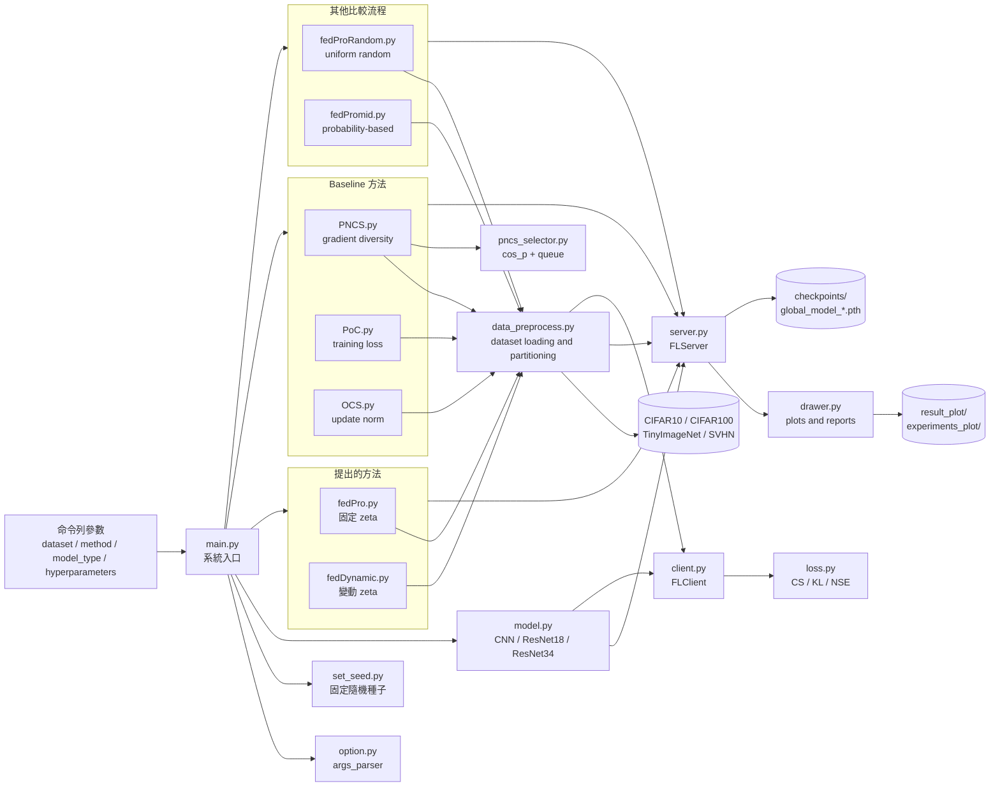
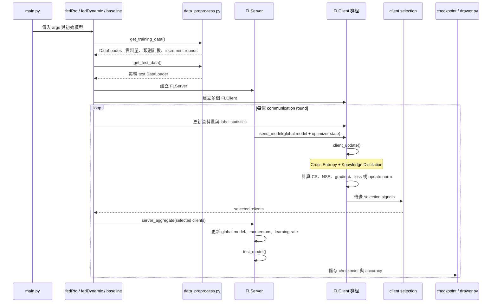
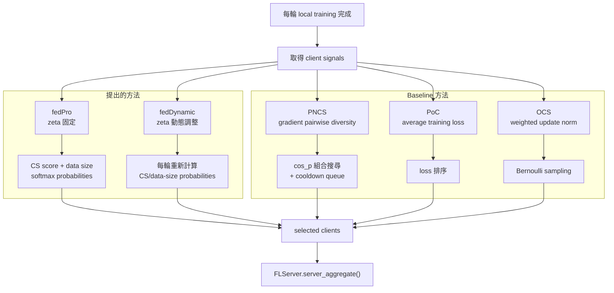
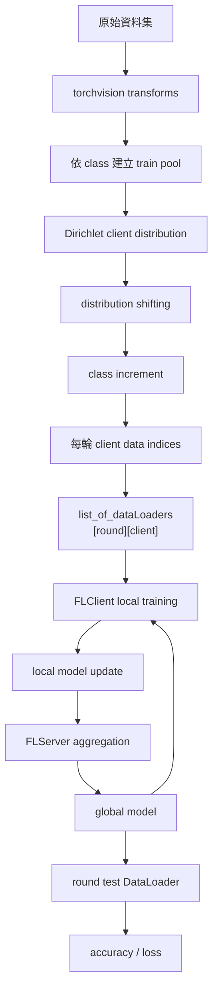

# FedClientSelection

## 專案說明

本專案研究在資料分布變動（distribution shifting）與類別增量（class increment）情境下的聯邦學習客戶端選擇問題。系統以 PyTorch 實作，支援 CIFAR10、CIFAR100、TinyImageNet 與 SVHN，並比較提出的方法與多種 baseline。

提出的方法有兩個版本：

- `fedPro`：提出的方法，使用固定的 `zeta` 值。
- `fedDynamic`：提出的方法，使用會隨訓練過程調整的變動 `zeta` 值。

Baseline 方法有：

- `PNCS`：使用 gradient diversity 與 `cos_p` 進行客戶端選擇。
- `PoC`：依照 local training loss 選擇客戶端。
- `OCS`：依照 model update norm 計算 sampling probability。

另外，`fedProRandom` 是均勻隨機選擇方法，`fedPromid` 是另一個 probability-based 實驗版本；兩者用於補充比較。`fedavg.py` 與 `proposed.py` 是未經目前 `main.py` dispatcher 使用的獨立舊版流程。

## 系統架構圖



## 主要檔案與職責

| 分類 | 檔案 | 職責 |
| --- | --- | --- |
| 入口 | `main.py` | 解析參數、建立模型，依 `--method` 分派訓練方法 |
| 設定 | `option.py` | 定義資料集、訓練輪數、client 數量與選擇超參數 |
| 模型 | `model.py` | 建立 CNN、ResNet18、ResNet34 |
| 資料 | `data_preprocess.py` | 載入資料、Dirichlet 分布、資料分布變動與 class increment |
| Client | `client.py` | 本地訓練、knowledge distillation、CS/NSE/gradient 計算 |
| Server | `server.py` | 傳送模型、聚合模型與 momentum、測試、scheduler、checkpoint |
| Loss | `loss.py` | KL divergence、cosine similarity 與 normalized Shannon entropy |
| 提出方法 | `fedPro.py` | 固定 `zeta` 的提出方法 |
| 提出方法 | `fedDynamic.py` | 變動 `zeta` 的提出方法 |
| Baseline | `PNCS.py`、`pncs_selector.py` | 依 gradient diversity 選擇 client |
| Baseline | `PoC.py` | 依 local average training loss 選擇 client |
| Baseline | `OCS.py` | 依 weighted update norm 與 Bernoulli sampling 選擇 client |
| 比較方法 | `fedProRandom.py` | 依均勻機率隨機選擇 client |
| 比較方法 | `fedPromid.py` | 依 CS 與資料量更新選擇機率 |
| 輸出 | `drawer.py` | 產生資料消耗、accuracy 與 client selection 圖表 |

## 聯邦學習每輪流程



## 提出方法與 Baseline 的差異



### `zeta` 的角色

在 `fedPro.py` 中，`zeta` 由參數 `args.zeta` 提供，於 signal 發生時用來固定地平衡 CS score 與 client data size：

```text
score = zeta * CS_score + (1 - zeta) * data_size_ratio
```

在 `fedDynamic.py` 中，設計目標是讓 `zeta` 依照訓練過程中的 client similarity 或其他訊號變化。該檔案目前保留動態更新邏輯的註解區塊，執行路徑會在每輪設定 `zeta = 0` 後重新計算 probabilities；因此 README 將它定位為「變動 zeta 的提出方法」，實際使用時仍應依實驗設定確認動態更新區塊是否啟用。

## 資料與模型流



## 執行方式

```bash
python3 main.py --method proposed --dataset CIFAR10 --model_type CNN
python3 main.py --method fedDynamic --dataset CIFAR10 --model_type CNN
python3 main.py --method PNCS --dataset CIFAR10 --model_type CNN
python3 main.py --method PoC --dataset CIFAR10 --model_type CNN
python3 main.py --method OCS --dataset CIFAR10 --model_type CNN
```

目前 `main.py` 支援的 method dispatcher 包含：`proposed`、`random`、`PoC`、`OCS`、`PNCS`、`fedPromid` 與 `fedDynamic`。其中：

- `--method proposed` 會呼叫 `fedPro.py`。
- `--method random` 會呼叫 `fedProRandom.py`。
- `--method fedDynamic` 會呼叫 `fedDynamic.py`。

實際執行時，請使用 `main.py` 中定義的 method 名稱，而不是直接以檔名作為 `--method` 值。

## 輸出結果

- `checkpoints/global_model_*.pth`：週期性 global model checkpoint。
- `checkpoints/global_model_final.pth`：最終 global model。
- `result_plot/`：accuracy 與 client selection 結果。
- `experiments_plot/`：資料量、類別分布與資料消耗結果。